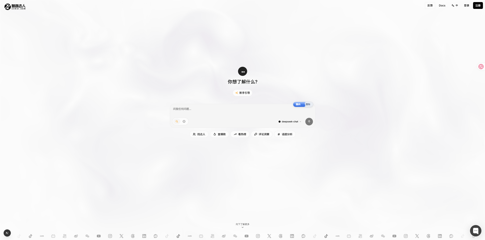

# 智选达人 (ZXKOL) — 给 AI Agent 的社媒数据 🌐

<p align="center"><a href="README.md">English</a> · <b>简体中文</b></p>

> 一句话查全网社媒数据。在 **Claude / Cursor / 任意 MCP 客户端**里，直接查达人、爆款、热榜、话题、评论舆情，覆盖**抖音、TikTok、小红书、B站、快手、微博、YouTube、Instagram** 等 18+ 平台。

<p align="center">
  <a href="https://github.com/kvalen-code/zxkol-skill/stargazers"></a>
  <a href="LICENSE"></a>
  
  
</p>

<p align="center">
  <a href="https://zxkol.com"></a>
</p>

**智选达人**把"找抖音美妆 10-50 万粉的达人"变成一次工具调用——不用爬虫、不用对接各平台 SDK。它是一个托管的 [Model Context Protocol](https://modelcontextprotocol.io) 服务 + 即插即用的 skill：加一段配置、拿一个 API key，你的 agent 就能从抖音、TikTok、小红书、B站、YouTube、Instagram 等平台拉取 KOL 数据、爆款内容、热榜、话题分析和 AI 评论洞察。

```text
你：    找抖音美妆 10-50 万粉的达人，再看看小红书现在的爆款。
Claude：→ creator_search(keyword="美妆", followerRange="10-50万")
        → content_search(keyword="美妆", platforms=["xiaohongshu"])
        ✓ 12 个达人 + 8 条爆款笔记，已汇总。
```

---

## ✨ 特性

- **一次调用，多平台 fan-out** —— 高层工具自动跨平台并发并归一化结果，对 LLM 友好。
- **18+ 平台** —— 抖音 / TikTok / 小红书 / B站 / 快手 / 微博 / YouTube / Instagram / Twitter(X) / Threads / Reddit / LinkedIn 等。
- **1000+ 原始接口** —— 用 `find_route` 语义检索 + `rest_call` 直达任意细分接口。
- **AI 评论舆情** —— 从评论里提炼情感、痛点、卖点、选题方向。
- **MCP 通用** —— Claude Desktop、Claude Code、Cursor、Continue、Windsurf、Cody 等都能用。
- **积分按量计费** —— 新用户送 **100 积分**，缓存命中**半价**。

## 🛠 工具

### 高层工具 —— 一行调用，自动 fan-out + 归一化

| 工具 | 用途 | 平台 |
|---|---|---|
| `creator_search` | 找达人 / KOL（抖音星图官方商业数据） | 抖音 |
| `content_search` | 跨平台搜索爆款内容 | 18 平台 |
| `hot_list` | 实时热榜 / 热搜 / 趋势 | 13 平台 |
| `content_detail` | 单条内容详情（数据/作者/媒体） | 17 平台 |
| `comment_insight` | AI 评论舆情分析 | 14 平台 |
| `hashtag_search` | 按关键词搜话题 / 标签 | 7+ 平台 |
| `hashtag_posts` | 某话题下的爆款内容 | 7+ 平台 |
| `douyin_index` | 抖音指数（关键词热度 / 品牌雷达 / 相似达人） | 抖音 |
| `douyin_xingtu` | 抖音星图 KOL 资料 / 受众 / 报价 | 抖音 |

### 通用工具 —— 直达 1000+ 原始接口

| 工具 | 用途 |
|---|---|
| `find_route` | **语义检索（top-5）** —— 传自然语言意图（中英混杂均可），返回最匹配路由 + 必填参数 |
| `list_routes` | 浏览全部路由，支持 `platform` + `keyword` 过滤 |
| `rest_call` | 按 `route` id（如 `douyin/lives/room-products`）+ `params` 调用任意接口 |

## 🚀 三步接入（2 分钟）

### 1. 获取 API Key

1. 注册 **[zxkol.com](https://zxkol.com)** —— 新用户送 **100 积分**。
2. 进 **[控制台 → API 密钥](https://zxkol.com/dashboard/api-keys)** → **创建 API Key**。
3. 复制 `zxk_live_...` key（只显示一次，立即保存）。

### 2. 添加 MCP 服务

**Claude Desktop** —— 编辑 `~/.claude/mcp.json`（macOS/Linux）或 `%USERPROFILE%\.claude\mcp.json`（Windows）：

```json
{
  "mcpServers": {
    "zxkol": {
      "type": "http",
      "url": "https://zxkol.com/api/mcp",
      "headers": { "Authorization": "Bearer zxk_live_你的key" }
    }
  }
}
```

**Cursor** —— `~/.cursor/mcp.json`，同样的配置。**Claude Code** —— 项目根目录的 `.mcp.json`。

> 更多可直接粘贴的配置见 [`examples/`](examples/)。

### 3. 直接问

重启客户端，工具会自动出现，直接提问即可。

> "今天抖音在流行什么？" · "分析这条 TikTok 视频的评论。" · "找几个小红书母婴博主。"

## 🧩 当作 Claude Code Skill 用

比起裸 MCP 配置更想要一个 skill？把 [`SKILL.md`](SKILL.md) 放进 `~/.claude/skills/zxkol/`（同目录放 [`mcp.json`](mcp.json)），Claude Code 会自动判断**何时**调用智选达人。

## 🔎 来源包交接

如果 agent 已经有人工确认过的 X/Twitter 监控或搜索导出，可以先把它们作为来源包交给智选达人，再做更广的平台分析。每个来源包都应保留：

- 来源 URL
- 抓取时间
- 引用片段或指标字段
- 任何可能进入发布文案内容的审批说明

OpenClaw 用户可以用 [TweetClaw](https://github.com/Xquik-dev/tweetclaw) 从搜索、回复、粉丝导出、监控摘要、媒体引用和 webhook 事件摘要中生成这些 X/Twitter 来源包。智选达人仍负责跨平台查询、路由选择、评论洞察和趋势分析。

## 💳 计费

- 按工具调用从 key 所属账号扣积分。
- **缓存命中半价** —— 重复查询几乎免费。
- B2B（API key 调用）有 1.5× 溢价。
- 完整定价：**[zxkol.com/pricing](https://zxkol.com/pricing)**

## 📚 链接

- 🌐 官网 —— https://zxkol.com
- 📖 API 文档 —— https://zxkol.com/docs/api
- 🔌 MCP 接入指南 —— https://zxkol.com/docs/mcp
- 🗺 覆盖矩阵（18 平台 / 26 能力 / 1000+ 接口）—— https://zxkol.com/about/coverage

---

## ⭐ 给个 Star

如果智选达人帮你省下了又一个爬虫，**点个 Star** —— 也方便更多人发现它。

## License

[MIT](LICENSE) —— 适用于本仓库的配置、文档与 skill 清单。智选达人托管服务与数据受 [zxkol.com](https://zxkol.com) 条款约束。
